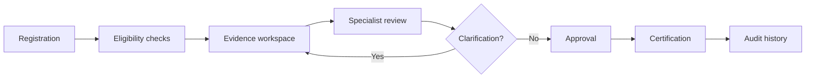

# Compliance workflow

## Control points
- Evidence is separated from the decision authority.
- Clarifications return to the evidence stage rather than bypassing review.
- Approval remains an accountable human decision.
- Audit events capture state changes.

## Prototype scope
The `/app` prototype implements local case creation, case detail, review-state transitions and an audit timeline using synthetic data. It is a portfolio build, not a production regulatory system.