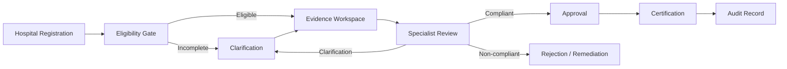

# 05 — Compliance Workflow

## Workflow

## Control Gates

### Gate 1 — Registration
Identity, facility and mandatory information.

### Gate 2 — Eligibility
Deterministic rule checks against configured criteria.

### Gate 3 — Evidence
Required documents and supporting evidence are complete and valid for review.

### Gate 4 — Specialist Review
Authorised reviewer records findings and requests clarification where required.

### Gate 5 — Decision
Approval authority records an accountable decision with rationale.

### Gate 6 — Certification
Certification is generated only after required controls and approvals are satisfied.

## Exception Handling

Every exception should have:

`reason + owner + due date + status + evidence + disposition`
