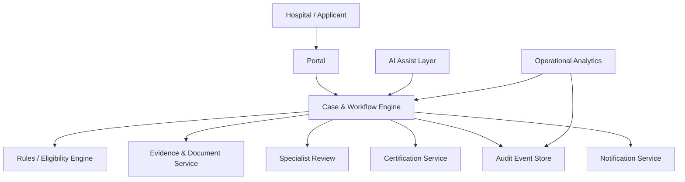

# 06 — Logical Architecture

## Architecture Principles

1. **Workflow is authoritative.**
2. **Eligibility rules are deterministic and configurable.**
3. **Evidence is linked to the case and decision.**
4. **AI is advisory, not authoritative.**
5. **Every material state transition is auditable.**
6. **Sensitive information is minimised and role-restricted.**

## Security

`Identity → RBAC → Case-level authorisation → Data access → Audit`

Production architecture should additionally define retention, backup/recovery, key management, threat modelling, logging/monitoring and applicable privacy/security controls.
